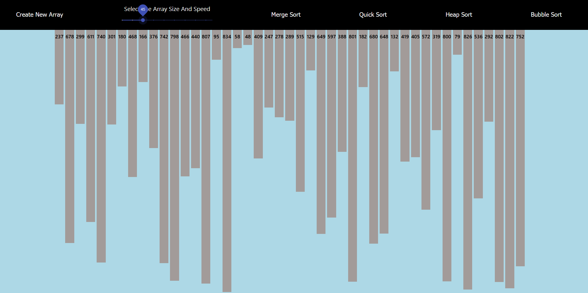
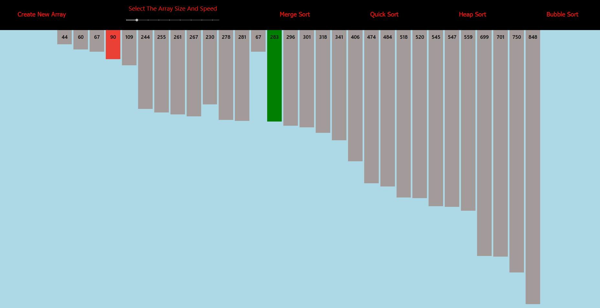
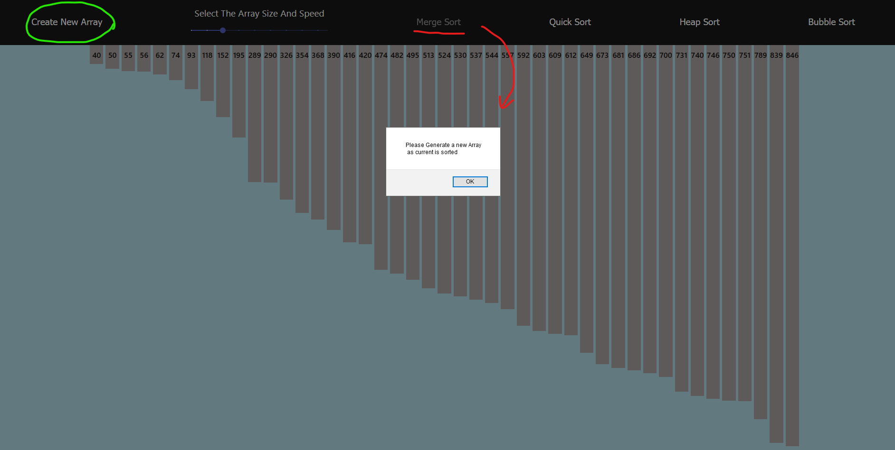

version 1.1.0 

# Purpose 

This is a Sorting visualizer is intended to provide the user with an interface where they can visualize various sorts. They are able to choose the size of the array they want to deal with which also correlates to the speed of the sort and the speed of the colours which are displayed to the screen. Can be accessed below : 

[Sorting Visualizer](https://sorting-visualizer1051.herokuapp.com)

# Implemented Technologies 

This full-stack application that is written in `React.js` ( a JavaScritp framework ) including ES6 syntax, with minimal ES5 usage with depends on the `Node.js` middleware ( greater than node version 9 atleast ). 

# Resources 

Inspiration of the sorting visualizer project is from : 
[Clement's Sorting visualizer](https://clementmihailescu.github.io/Sorting-Visualizer/)

[Bubble Sort](https://www.geeksforgeeks.org/bubble-sort/)\
[Heap Sort](https://www.geeksforgeeks.org/heap-sort/)\
[Quick Sort](https://www.geeksforgeeks.org/quick-sort/)\
[Merge Sort](https://www.geeksforgeeks.org/merge-sort/)\

Download Node.js: 
[Node.js](https://nodejs.org/en/)

Further information on React.js:
[React.js](https://reactjs.org/docs/create-a-new-react-app.html)

# Features and Usage

### Getting to know the navigation bar 

#### Create New Array
The very first button Create New array will simply create a new array of random numbers when pressed according to 
the currently scaled slider size on the right. 

#### Change Array Size and Speed 
This button will allow the user to change the size of the array that we are dealing with, which also changes the speed 
of the visualization of the colours that are rendered based on this size of the array automatically. When the size changes 
to more than 45, the sizes of the bars are not displayed 

#### Full model view 
Below is a full model view of the UI provided with all the features displayed. 

#### The Sorting View
When a sort is selected, the colour of all the buttons change and they cannot be selected during the sort. 
If the sorting wants to be shut down, the page will need a refresh and UI will reset. 

#### After The Sort
Once the sort is complete the buttons will change however, the user still cannot select another button 
as the current array is already sorted. They will need to press `Create New Array`. The user will be prompted by an error while trying to do so. 

# Contact 
Feel free to contact me at my email : **maazsyedbusiness@gmail.com** for any further questions about the code itself 
and if there's any changes or suggestions feel free to leave those as well :). Thank you for taking a look 

